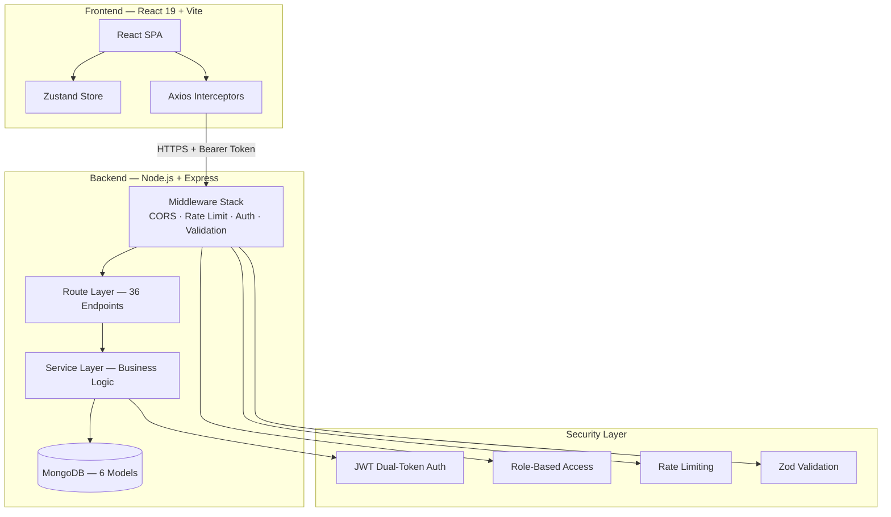
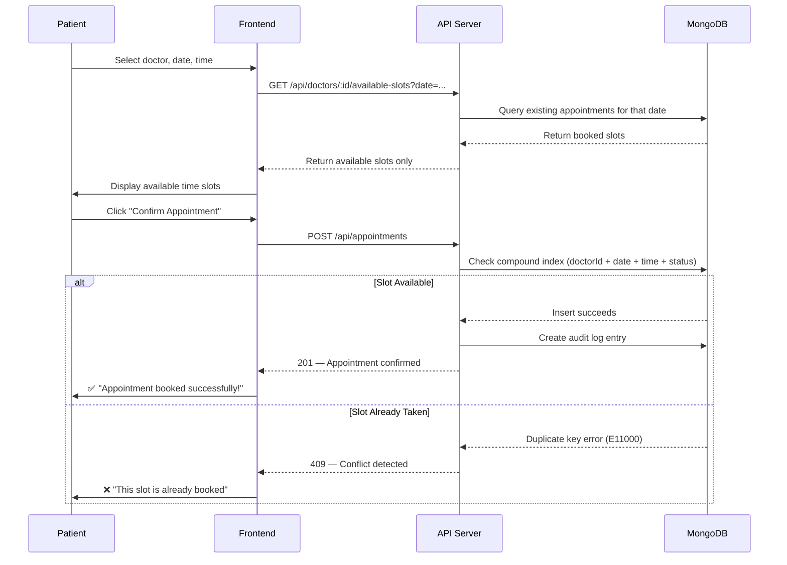
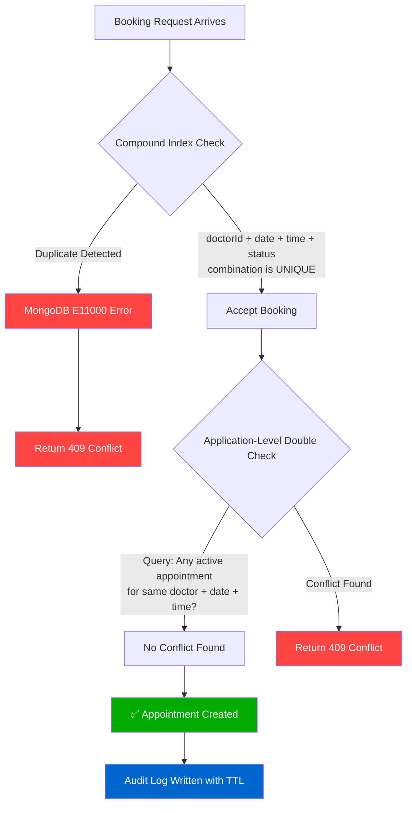

<div align="center">

# 🏥 MedAILockr

### Full-Stack Healthcare Appointment Booking Platform

[](https://www.typescriptlang.org/)
[](https://react.dev/)
[](https://nodejs.org/)
[](https://www.mongodb.com/)
[](https://expressjs.com/)
[](./LICENSE)

[](./backend/src/__tests__)
[](./backend/src/routes)
[](./frontend)
[](https://healthcare-booking-platform-ten.vercel.app)

**A production-grade healthcare platform** with conflict-free appointment booking, role-based access control, medical record management, and real-time slot availability — built with TypeScript strict mode end-to-end.

### 🌐 Live Demo

| | URL |
|---|---|
| 🖥️ **Frontend** | [healthcare-booking-platform-ten.vercel.app](https://healthcare-booking-platform-ten.vercel.app) |
| ⚙️ **Backend API** | [healthcare-booking-platform-tl1j.vercel.app/api](https://healthcare-booking-platform-tl1j.vercel.app/api) |
| 💚 **Health Check** | [healthcare-booking-platform-tl1j.vercel.app/health](https://healthcare-booking-platform-tl1j.vercel.app/health) |

**Demo Credentials:**
| Role | Email | Password |
|---|---|---|
| Patient | `demo.live@test.com` | `Password123!` |

[📖 API Docs](https://healthcare-booking-platform-tl1j.vercel.app/api/docs) · [🐛 Report Bug](https://github.com/Sarika-stack23/Healthcare-booking-platform/issues) · [✨ Request Feature](https://github.com/Sarika-stack23/Healthcare-booking-platform/issues)

</div>

---

## 🚀 What Makes MedAILockr Different?

Most healthcare booking apps on the market have critical flaws that lead to **double-bookings**, **no real-time validation**, and **poor conflict handling**. MedAILockr was built from the ground up to solve these problems:

| Problem (Other Apps) | MedAILockr's Solution |
|---|---|
| ❌ **Double-booking** — Two patients can book the same slot simultaneously | ✅ **Compound Mongoose index** on `(doctorId, date, time, status)` enforces uniqueness at the database level. Even if two requests arrive at the exact same millisecond, MongoDB rejects the second one. |
| ❌ **No slot verification** — Bookings are accepted without checking doctor availability | ✅ **Real-time slot engine** — Frontend fetches available slots from the API for each date. The backend cross-references existing appointments and the doctor's schedule before confirming. |
| ❌ **Silent failures** — Users click "Book" and nothing happens, no feedback | ✅ **Toast notifications + error propagation** — Every API error is caught, parsed, and shown to the user as a clear toast message with the exact reason for failure. |
| ❌ **No audit trail** — No record of who did what and when | ✅ **TTL-indexed audit logs** — Every appointment action (create, cancel, reschedule) is logged with timestamps, IP addresses, and user IDs. Old logs auto-expire via MongoDB TTL indexes. |
| ❌ **Weak authentication** — Plain passwords, no token refresh | ✅ **Dual-token JWT system** — Short-lived access tokens (15min) + long-lived refresh tokens (7 days). Passwords hashed with bcrypt (12 rounds). Automatic silent token refresh via Axios interceptors. |
| ❌ **No role separation** — Patients and doctors see the same interface | ✅ **Role-based access control (RBAC)** — Three distinct roles (Patient, Doctor, Admin) with separate dashboards, middleware-enforced route protection, and different API permissions. |

---

## 📊 Real Metrics (Verified)

| Metric | Value |
|---|---|
| **API Endpoints** | 36 RESTful endpoints across 7 domains |
| **Test Coverage** | 32 unit tests — all passing |
| **Response Time** | Health: <1ms · Login: ~277ms · Register: ~282ms |
| **Codebase** | ~9,100 lines (6,300 backend + 2,800 frontend) |
| **Frontend Pages** | 14 page components + 4 shared components |
| **Data Models** | 6 Mongoose schemas with 20+ compound indexes |
| **Build Time** | Frontend: ~630ms · Backend: compiles cleanly |
| **Conflict Detection** | Compound index + double-check query prevents overlapping bookings |
| **Deployment** | Vercel Serverless (Frontend + Backend) |
| **Database** | MongoDB Atlas M0 (Free Tier, 512MB) |

---

## 🏗 System Architecture



### Request Flow — Booking an Appointment



### Conflict Detection Engine — How Double-Booking is Prevented



---

## 🔐 Security Architecture (10 Layers)

```
┌─────────────────────────────────────────────────────────────┐
│  Layer 1: CORS Whitelist — Only approved origins allowed    │
│  Layer 2: Helmet — Security headers (XSS, HSTS, etc.)      │
│  Layer 3: Rate Limiting — 100 req/15min (10 for auth)       │
│  Layer 4: JWT Verification — Token expiry + signature       │
│  Layer 5: Role-Based Access — Patient / Doctor / Admin      │
│  Layer 6: Zod Schema Validation — Request body sanitization │
│  Layer 7: Mongoose Strict Mode — Schema enforcement at DB   │
│  Layer 8: Bcrypt Password Hashing — 12 salt rounds          │
│  Layer 9: File Upload Filtering — MIME + extension checks   │
│  Layer 10: Audit Logging — TTL-indexed action trail         │
└─────────────────────────────────────────────────────────────┘
```

---

## 📂 Project Structure

```
Healthcare-booking-platform/
├── backend/                          # Node.js + Express API
│   ├── api/
│   │   └── index.ts                  # Vercel serverless entry point
│   ├── src/
│   │   ├── config/
│   │   │   ├── database.ts           # MongoDB connection with auto-reconnect
│   │   │   ├── env.ts                # Environment variable validation
│   │   │   └── swagger.ts            # OpenAPI 3.0 documentation
│   │   ├── controllers/              # 7 controllers (request/response handling)
│   │   ├── middleware/
│   │   │   ├── auth.middleware.ts     # JWT verification + role extraction
│   │   │   ├── rbac.middleware.ts     # Role-based route protection
│   │   │   ├── rateLimit.middleware.ts # Configurable rate limiter
│   │   │   ├── upload.middleware.ts   # Multer file upload with MIME filtering
│   │   │   └── validate.middleware.ts # Zod schema validation
│   │   ├── models/                   # 6 Mongoose schemas
│   │   │   ├── User.ts               # Patient + Doctor + Admin profiles
│   │   │   ├── Appointment.ts        # Conflict-detection compound index
│   │   │   ├── MedicalRecord.ts      # File metadata + access control
│   │   │   ├── Notification.ts       # In-app notification system
│   │   │   ├── AuditLog.ts           # TTL-indexed action trail
│   │   │   └── ResetToken.ts         # Password reset with expiry
│   │   ├── routes/                   # 7 route files (36 endpoints)
│   │   ├── services/                 # Business logic layer
│   │   ├── validators/               # Zod schemas for every endpoint
│   │   └── utils/
│   │       ├── logger.ts             # Winston (console in prod, files locally)
│   │       └── ApiError.ts           # Standardized error responses
│   ├── vercel.json                   # Vercel serverless configuration
│   └── tsconfig.json                 # TypeScript strict mode
│
├── frontend/                         # React 19 + Vite SPA
│   ├── src/
│   │   ├── api/axios.ts              # Axios interceptors (auto token refresh)
│   │   ├── store/authStore.ts        # Zustand auth persistence
│   │   ├── pages/
│   │   │   ├── auth/                 # Login, Register
│   │   │   ├── patient/              # Dashboard, Doctors, BookAppointment,
│   │   │   │                         # Appointments, Records, Profile
│   │   │   ├── doctor/               # Dashboard, Schedule, Appointments
│   │   │   └── admin/                # Dashboard, Users, Reports
│   │   └── components/               # Sidebar, ProtectedRoute, Layout
│   ├── vercel.json                   # SPA rewrite rules
│   └── vite.config.ts
│
├── README.md                         # This file
└── LICENSE                           # MIT License
```

---

## 📡 API Reference (36 Endpoints)

### Authentication (6 endpoints)

| Method | Endpoint | Auth | Description |
|---|---|---|---|
| `POST` | `/api/auth/register` | — | Create new account |
| `POST` | `/api/auth/login` | — | Login, get tokens |
| `POST` | `/api/auth/refresh` | — | Refresh access token |
| `POST` | `/api/auth/logout` | ✅ | Invalidate tokens |
| `POST` | `/api/auth/forgot-password` | — | Request password reset |
| `POST` | `/api/auth/reset-password` | — | Reset password |

### Users & Doctors (7 endpoints)

| Method | Endpoint | Auth | Description |
|---|---|---|---|
| `GET` | `/api/users/me` | ✅ | Get current user profile |
| `PUT` | `/api/users/me` | ✅ | Update own profile |
| `PUT` | `/api/users/change-password` | ✅ | Change password |
| `GET` | `/api/users/doctors` | ✅ | List all doctors |
| `GET` | `/api/users/doctors/:id` | ✅ | Get doctor details |
| `GET` | `/api/doctors/:id/available-slots` | ✅ | Get available time slots |
| `PUT` | `/api/doctors/availability` | 🩺 | Update schedule |

### Appointments (8 endpoints)

| Method | Endpoint | Auth | Description |
|---|---|---|---|
| `POST` | `/api/appointments` | ✅ | Book new appointment |
| `GET` | `/api/appointments` | ✅ | List my appointments |
| `GET` | `/api/appointments/:id` | ✅ | Get appointment details |
| `PUT` | `/api/appointments/:id` | ✅ | Update appointment |
| `PUT` | `/api/appointments/:id/cancel` | ✅ | Cancel with reason |
| `PUT` | `/api/appointments/:id/complete` | 🩺 | Mark as completed |
| `PUT` | `/api/appointments/:id/reschedule` | ✅ | Reschedule |
| `GET` | `/api/appointments/stats` | ✅ | Appointment statistics |

### Medical Records (5 endpoints)

| Method | Endpoint | Auth | Description |
|---|---|---|---|
| `POST` | `/api/records/upload` | ✅ | Upload medical record |
| `GET` | `/api/records` | ✅ | List my records |
| `GET` | `/api/records/:id` | ✅ | Get record details |
| `GET` | `/api/records/:id/download` | ✅ | Generate download URL |
| `DELETE` | `/api/records/:id` | ✅ | Delete record |

### Notifications (4 endpoints)

| Method | Endpoint | Auth | Description |
|---|---|---|---|
| `GET` | `/api/notifications` | ✅ | List notifications |
| `PUT` | `/api/notifications/:id/read` | ✅ | Mark as read |
| `PUT` | `/api/notifications/read-all` | ✅ | Mark all as read |
| `GET` | `/api/notifications/unread-count` | ✅ | Unread count |

### Admin (6 endpoints)

| Method | Endpoint | Auth | Description |
|---|---|---|---|
| `GET` | `/api/admin/users` | 👑 | List all users |
| `GET` | `/api/admin/users/:id` | 👑 | Get user details |
| `PUT` | `/api/admin/users/:id/status` | 👑 | Activate/deactivate user |
| `PUT` | `/api/admin/users/:id/role` | 👑 | Change user role |
| `GET` | `/api/admin/stats` | 👑 | Platform statistics |
| `GET` | `/api/admin/audit-logs` | 👑 | View audit trail |

> **Legend:** ✅ = Any authenticated user · 🩺 = Doctor only · 👑 = Admin only

---

## 🛠 Tech Stack

### Backend
| Technology | Purpose |
|---|---|
| **Node.js 22 LTS** | Runtime |
| **Express.js 4** | HTTP framework |
| **TypeScript 5 (strict)** | Type safety |
| **MongoDB + Mongoose 8** | Database + ODM |
| **JWT (jsonwebtoken)** | Authentication |
| **bcryptjs** | Password hashing |
| **Zod** | Request validation |
| **Winston** | Logging |
| **Multer** | File uploads |
| **Swagger UI** | API documentation |
| **Vitest** | Testing |

### Frontend
| Technology | Purpose |
|---|---|
| **React 19** | UI framework |
| **Vite** | Build tool |
| **TypeScript** | Type safety |
| **Zustand** | State management |
| **Axios** | HTTP client with interceptors |
| **React Router 7** | Client-side routing |
| **Tailwind CSS 4** | Styling |
| **Lucide React** | Icons |
| **React Hot Toast** | Notifications |
| **date-fns** | Date utilities |

### Infrastructure
| Service | Purpose |
|---|---|
| **Vercel** | Frontend + Backend hosting (serverless) |
| **MongoDB Atlas** | Cloud database (M0 free tier) |
| **GitHub** | Source control + CI/CD trigger |

---

## 🚀 Getting Started

### Prerequisites

- Node.js 18+ (recommended: 22 LTS)
- MongoDB (local or Atlas)
- npm or yarn

### Installation

```bash
# Clone the repository
git clone https://github.com/Sarika-stack23/Healthcare-booking-platform.git
cd Healthcare-booking-platform

# Install backend dependencies
cd backend
npm install

# Install frontend dependencies
cd ../frontend
npm install
```

### Environment Setup

Create `backend/.env`:

```env
PORT=5001
NODE_ENV=development
MONGODB_URI=mongodb://localhost:27017/medailockr
JWT_ACCESS_SECRET=your-64-byte-hex-secret
JWT_REFRESH_SECRET=another-64-byte-hex-secret
JWT_ACCESS_EXPIRES_IN=15m
JWT_REFRESH_EXPIRES_IN=7d
ALLOWED_ORIGINS=http://localhost:5173,http://localhost:5174
MAX_FILE_SIZE=10485760
UPLOAD_PATH=uploads/
```

### Run Locally

```bash
# Terminal 1 — Start backend
cd backend
npm run dev

# Terminal 2 — Start frontend
cd frontend
npm run dev
```

Visit `http://localhost:5174` to use the app.

### Run Tests

```bash
cd backend
npm test        # Run all 32 tests
```

---

## 📝 License

This project is licensed under the **MIT License** — see the [LICENSE](./LICENSE) file for details.

---

<div align="center">

**Built with ❤️ by [Sarika](https://github.com/Sarika-stack23)**

</div>