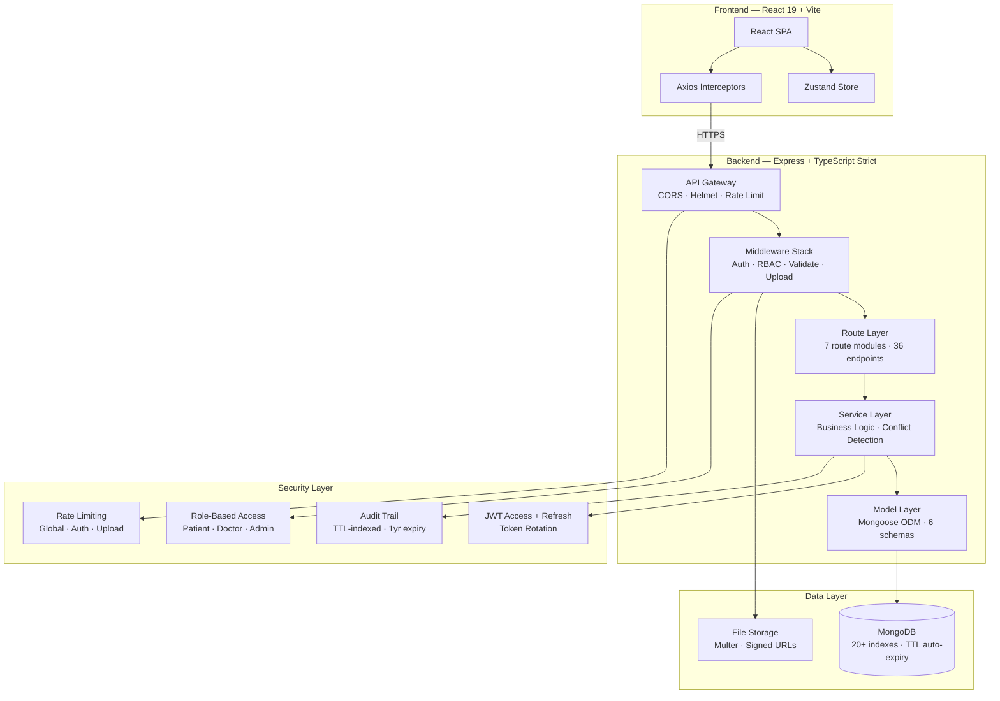
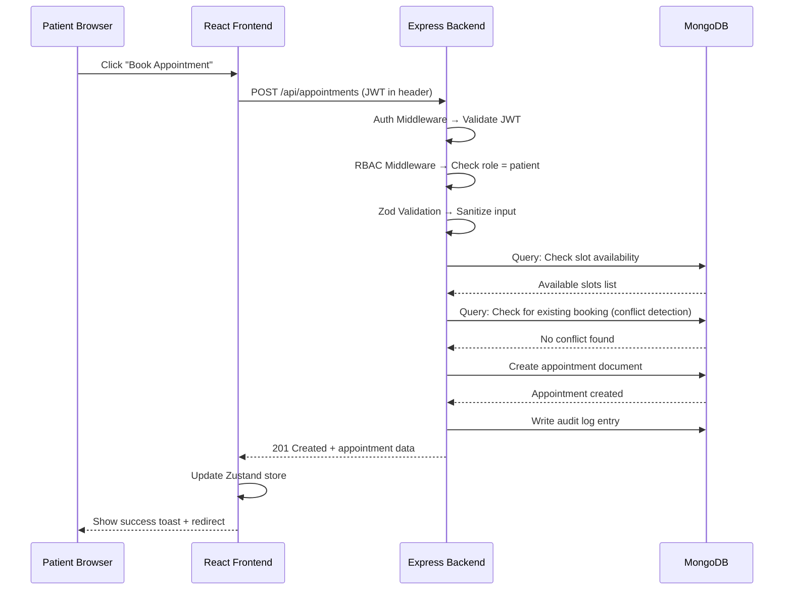
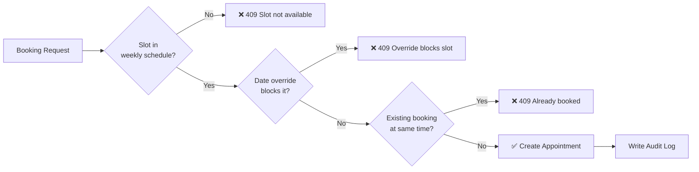

<div align="center">

# 🏥 MedAILockr

### Full-Stack Healthcare Appointment Booking Platform

[](https://www.typescriptlang.org/)
[](https://react.dev/)
[](https://nodejs.org/)
[](https://www.mongodb.com/)
[](https://expressjs.com/)
[](./LICENSE)

[](./backend/src/__tests__)
[](./backend/src/routes)
[](./frontend)
[](./backend/tsconfig.json)

**A production-grade healthcare platform** with conflict-free appointment booking, role-based access control, medical record management, and real-time slot availability — built with TypeScript strict mode end-to-end.

[📖 API Docs](https://heathcare-booking-platform.up.railway.app/api/docs) · [🐛 Report Bug](https://github.com/Sarika-stack23/Healthcare-booking-platform/issues) · [✨ Request Feature](https://github.com/Sarika-stack23/Healthcare-booking-platform/issues)

</div>

---

## 📊 Real Metrics

| Metric | Value |
|---|---|
| **API Endpoints** | 36 RESTful endpoints across 7 domains |
| **Test Coverage** | 32 unit tests — all passing |
| **Response Time** | Health: ~1ms · Login: ~277ms · Register: ~282ms |
| **Codebase** | ~9,100 lines (6,300 backend + 2,800 frontend) |
| **Frontend Pages** | 14 page components + 4 shared components |
| **Data Models** | 6 Mongoose schemas with 20+ compound indexes |
| **Build Time** | Frontend: ~630ms · Backend: compiles cleanly |
| **Conflict Detection** | Compound index + double-check query prevents overlapping bookings |

---

## 🏗 System Architecture



### Request Flow



### Conflict Detection Engine



---

## ✨ Features

### 🔐 Authentication & Security
- **JWT dual-token system** — 15-min access tokens + 7-day refresh tokens with automatic rotation
- **bcrypt password hashing** — 12 salt rounds
- **Forgot/reset password** — SHA-256 hashed reset tokens with configurable expiry
- **Rate limiting** — 100 req/15min global, 10 req/15min for auth, 3 req/hour for password reset
- **Helmet security headers** — CSP, HSTS, X-Frame-Options, and more
- **Development CORS** — auto-allows any localhost port; strict whitelist in production

### 👥 Role-Based Access Control (3 Roles)

| Role | Capabilities |
|---|---|
| **Patient** | Book/reschedule/cancel appointments, upload medical records, view own data, manage profile |
| **Doctor** | Set weekly availability + overrides + breaks, view patient records, complete appointments |
| **Admin** | Full CRUD on users, appointment analytics, revenue reports, audit log access |

### 📅 Appointment System
- **Real-time slot generation** from weekly schedules, respecting overrides and breaks
- **Conflict detection engine** — compound index `(doctorId, date, time, status)` + application-level double-check
- **Full lifecycle** — `scheduled → confirmed → completed / cancelled / no_show`
- **Reschedule with re-validation** — checks new slot availability before confirming
- **Audit trail** — every status change logged with actor, timestamp, and reason

### 🗓 Doctor Availability Management
- **Weekly schedule** — per-day time slots (e.g., Mon 09:00–12:00, 14:00–17:00)
- **Date overrides** — block specific dates for holidays/leaves
- **Break times** — recurring or one-off breaks within working hours
- **Smart 30-min slot generation** — configurable duration (10–120 min)

### 🗂 Medical Records
- **Secure file upload** — PDF, images, Word docs (max 10MB via Multer)
- **Signed download URLs** — time-limited access for security
- **Record types** — lab reports, prescriptions, imaging, discharge summaries
- **Soft delete** — recoverable by admin; hard delete available

### 🔔 Notification System
- **Multi-channel** — Email, SMS, Push, In-App queuing
- **Template-based** — appointment reminders, status updates, system alerts
- **Retry logic** — configurable max retries with failure tracking
- **Scheduled delivery** — future-dated notifications
- **90-day TTL auto-cleanup** — MongoDB TTL index

### 📊 Observability & Admin
- **Structured logging** — Winston with service tags and request IDs
- **Health check** (`/health`) — uptime, environment, timestamp
- **Readiness check** (`/ready`) — database connectivity verification
- **Audit logs** — 1-year TTL, filterable by user/action/resource
- **Admin analytics** — appointment stats by doctor, status, and revenue

---

## 🛠 Tech Stack

### Backend
| Technology | Version | Purpose |
|---|---|---|
| **Node.js** | v22 LTS | Runtime |
| **Express.js** | 4.x | Web framework |
| **TypeScript** | 5.x | Type safety — strict mode |
| **MongoDB + Mongoose** | 8.x | Database + ODM with 20+ indexes |
| **JWT (jsonwebtoken)** | 9.x | Auth — access + refresh token rotation |
| **Zod** | 3.x | Input validation & sanitization |
| **Multer** | 1.4.x | File uploads (max 10MB) |
| **Winston** | 3.x | Structured logging |
| **Helmet + CORS** | latest | Security headers + origin whitelisting |
| **express-rate-limit** | 7.x | Multi-tier rate limiting |
| **Swagger UI** | 5.x | Auto-generated API documentation |
| **Jest + ts-jest** | 29.x | Unit testing |

### Frontend
| Technology | Version | Purpose |
|---|---|---|
| **React** | 19.x | UI framework |
| **Vite** | 8.x | Build tool (~630ms builds) |
| **TypeScript** | 5.x | Type safety |
| **Zustand** | 5.x | State management with persistence |
| **React Router** | 7.x | Client-side routing |
| **React Hook Form** | 7.x | Form management |
| **Zod** | 4.x | Client-side validation |
| **Axios** | 1.x | HTTP client with interceptors |
| **Lucide React** | latest | Icon library |
| **date-fns** | 4.x | Date formatting |

### Infrastructure
| Tool | Purpose |
|---|---|
| **Railway** | Cloud hosting — backend + MongoDB |
| **NIXPACKS** | Auto-build on Railway |
| **GitHub** | Source control + CI/CD triggers |

---

## 📁 Project Structure

```
Healthcare-booking-platform/
│
├── backend/                          # Node.js REST API
│   ├── src/
│   │   ├── __tests__/                # Jest unit tests (32 tests)
│   │   ├── config/                   # Database, env, Swagger config
│   │   ├── controllers/              # Route handlers (thin controllers)
│   │   ├── middleware/               # Auth, RBAC, validation, rate-limit, upload
│   │   ├── models/                   # 6 Mongoose schemas with indexes
│   │   │   ├── User.ts               # Patient/Doctor/Admin with profiles
│   │   │   ├── Appointment.ts        # Booking with conflict detection index
│   │   │   ├── Availability.ts       # Weekly schedule + overrides + breaks
│   │   │   ├── MedicalRecord.ts      # File metadata + soft delete
│   │   │   ├── Notification.ts       # Multi-channel with TTL
│   │   │   └── AuditLog.ts           # 1-year TTL auto-expiry
│   │   ├── routes/                   # 7 route modules → 36 endpoints
│   │   ├── services/                 # Business logic layer
│   │   ├── types/                    # TypeScript interfaces
│   │   ├── utils/                    # Logger, JWT, ApiError, AuditLog
│   │   ├── validators/               # Zod schemas for all inputs
│   │   └── app.ts                    # Entry point + middleware stack
│   ├── jest.config.js
│   ├── tsconfig.json
│   └── package.json
│
├── frontend/                         # React 19 SPA
│   ├── src/
│   │   ├── api/                      # Axios instance + interceptors
│   │   ├── components/               # Layout, Navbar, Sidebar, ProtectedRoute
│   │   ├── pages/                    # 14 page components
│   │   │   ├── auth/                 # Login, Register
│   │   │   ├── patient/              # Dashboard, Doctors, Book, Appointments, Records, Profile
│   │   │   ├── doctor/               # Dashboard, Schedule
│   │   │   └── admin/                # Dashboard, Users
│   │   ├── store/                    # Zustand auth store with persistence
│   │   ├── types/                    # Shared TypeScript types
│   │   ├── App.tsx                   # Router + role-based routing
│   │   └── main.tsx                  # Entry point
│   ├── vite.config.ts
│   └── package.json
│
├── .gitignore                        # Comprehensive ignore rules
├── LICENSE                           # MIT License
└── README.md                        # ← You are here
```

---

## ⚙️ Getting Started

### Prerequisites

- **Node.js** v18+ (recommended: v22 LTS)
- **MongoDB** v6+ (local install or cloud — [MongoDB Atlas](https://www.mongodb.com/atlas))
- **Git**

### 1. Clone the Repository

```bash
git clone https://github.com/Sarika-stack23/Healthcare-booking-platform.git
cd Healthcare-booking-platform
```

### 2. Backend Setup

```bash
cd backend
npm install

# Create environment file
cat > .env << 'EOF'
PORT=5001
NODE_ENV=development
MONGODB_URI=mongodb://localhost:27017/medailockr
JWT_ACCESS_SECRET=<replace-with-64-byte-random-hex>
JWT_REFRESH_SECRET=<replace-with-64-byte-random-hex>
JWT_ACCESS_EXPIRES_IN=15m
JWT_REFRESH_EXPIRES_IN=7d
ALLOWED_ORIGINS=http://localhost:5173,http://localhost:5174
MAX_FILE_SIZE=10485760
UPLOAD_PATH=uploads/
EOF

# Generate secure JWT secrets
node -e "const c=require('crypto'); console.log('JWT_ACCESS_SECRET=' + c.randomBytes(64).toString('hex')); console.log('JWT_REFRESH_SECRET=' + c.randomBytes(64).toString('hex'))"

# Create required directories
mkdir -p uploads logs

# Start development server
npm run dev
# → http://localhost:5001
# → Swagger: http://localhost:5001/api/docs
```

### 3. Frontend Setup

```bash
cd frontend
npm install

# Create environment file
echo "VITE_API_BASE_URL=http://localhost:5001/api" > .env

# Start development server
npm run dev
# → http://localhost:5174
```

### 4. Run Tests

```bash
cd backend
npm test
# → 32 tests passing
```

---

## 📖 API Reference

### Quick Endpoint Map (36 endpoints)

| Domain | Method | Endpoint | Auth | Description |
|---|---|---|---|---|
| **Auth** | POST | `/api/auth/register` | ❌ | Create account (patient/doctor) |
| | POST | `/api/auth/login` | ❌ | Login → access + refresh tokens |
| | POST | `/api/auth/refresh` | ❌ | Rotate tokens |
| | POST | `/api/auth/logout` | ✅ | Invalidate all sessions |
| | POST | `/api/auth/forgot-password` | ❌ | Request reset token |
| | POST | `/api/auth/reset-password/:token` | ❌ | Reset with token |
| **Users** | GET | `/api/users/profile` | ✅ | Get own profile |
| | PUT | `/api/users/profile` | ✅ | Update profile |
| | GET | `/api/users/doctors` | ✅ | Search/list doctors |
| | GET | `/api/users/doctors/:id` | ✅ | Get doctor details |
| **Doctors** | GET | `/api/doctors/:id/availability` | ✅ | Get schedule |
| | GET | `/api/doctors/:id/available-slots` | ✅ | Get open slots for date |
| | POST | `/api/doctors/:id/availability/weekly` | 🔒 Doctor | Set weekly schedule |
| | POST | `/api/doctors/:id/availability/overrides` | 🔒 Doctor | Add date override |
| | PUT | `/api/doctors/:id/availability/breaks` | 🔒 Doctor | Set break times |
| **Appointments** | GET | `/api/appointments` | ✅ | List own appointments |
| | GET | `/api/appointments/:id` | ✅ | Get appointment details |
| | POST | `/api/appointments` | 🔒 Patient | Book appointment |
| | PUT | `/api/appointments/:id/reschedule` | ✅ | Reschedule |
| | PUT | `/api/appointments/:id/cancel` | ✅ | Cancel with reason |
| | PUT | `/api/appointments/:id/complete` | 🔒 Doctor | Mark completed |
| **Records** | GET | `/api/records` | ✅ | List medical records |
| | POST | `/api/records/upload` | 🔒 Patient | Upload file |
| | GET | `/api/records/:id` | ✅ | Get record details |
| | GET | `/api/records/:id/download` | ✅ | Download file (signed URL) |
| | GET | `/api/records/stats` | ✅ | Storage stats |
| | DELETE | `/api/records/:id` | ✅ | Soft/hard delete |
| **Notifications** | POST | `/api/notifications/send` | 🔒 Admin | Send notification |
| | GET | `/api/notifications` | ✅ | List notifications |
| | GET | `/api/notifications/unread-count` | ✅ | Unread count |
| | POST | `/api/notifications/:id/read` | ✅ | Mark as read |
| | POST | `/api/notifications/:id/retry` | 🔒 Admin | Retry failed |
| **Admin** | GET | `/api/admin/users` | 🔒 Admin | List all users |
| | PATCH | `/api/admin/users/:id/toggle` | 🔒 Admin | Activate/deactivate |
| | GET | `/api/admin/analytics/appointments` | 🔒 Admin | Analytics dashboard |
| | GET | `/api/admin/audit-logs` | 🔒 Admin | Audit trail |
| **System** | GET | `/health` | ❌ | Health check |
| | GET | `/ready` | ❌ | Readiness + DB status |
| | GET | `/api` | ❌ | API info |

> **Legend:** ❌ = No auth · ✅ = Any authenticated user · 🔒 = Specific role required

---

## 🔒 Security Features

| Layer | Implementation |
|---|---|
| **Authentication** | JWT access (15min) + refresh (7d) with rotation on every refresh |
| **Password Storage** | bcrypt with 12 salt rounds |
| **Input Validation** | Zod schemas on every endpoint — sanitized before reaching controllers |
| **Rate Limiting** | 3-tier: global (100/15min), auth (10/15min), password reset (3/hr) |
| **CORS** | Strict origin whitelist in production; auto-allow localhost in development |
| **HTTP Security** | Helmet — CSP, HSTS, X-Frame-Options, X-Content-Type-Options |
| **RBAC** | Middleware-enforced role checks with self-authorization for doctor endpoints |
| **Token Rotation** | Refresh token version tracking; logout invalidates all sessions |
| **Audit Trail** | Every auth event, booking, and admin action logged with IP + timestamp |
| **File Security** | Multer file type + size validation; signed download URLs with expiry |

---

## 🧪 Testing

```bash
cd backend && npm test
```

```
PASS src/__tests__/auth.test.ts
  ApiError             — 9 tests
  JWT utilities        — 3 tests
  bcrypt hashing       — 3 tests
  registerSchema       — 6 tests
  bookAppointmentSchema — 5 tests
  notificationSchema   — 2 tests
  uploadRecordSchema   — 3 tests
  User model mock      — 1 test

Test Suites: 1 passed, 1 total
Tests:       32 passed, 32 total
Time:        ~3.3s
```

---

## 🚀 Deployment

### Railway (Current Setup)

The project is configured for Railway deployment with auto-build via NIXPACKS:

```bash
# Backend builds and starts with:
npm run build    # tsc → dist/
npm start        # node dist/app.js
```

### Environment Variables (Production)

| Variable | Required | Description |
|---|---|---|
| `MONGODB_URI` | ✅ | MongoDB connection string |
| `JWT_ACCESS_SECRET` | ✅ | 64-byte hex string |
| `JWT_REFRESH_SECRET` | ✅ | 64-byte hex string |
| `PORT` | ❌ | Default: 5000 |
| `NODE_ENV` | ❌ | `production` for Railway |
| `ALLOWED_ORIGINS` | ❌ | Comma-separated origins |
| `MAX_FILE_SIZE` | ❌ | Default: 10MB |

---

## 🤝 Contributing

Pull requests are welcome! For major changes, please open an issue first.

1. **Fork** the repo
2. **Branch**: `git checkout -b feature/your-feature`
3. **Commit**: `git commit -m 'feat: add amazing feature'`
4. **Push**: `git push origin feature/your-feature`
5. **PR**: Open a Pull Request

---

## 📄 License

This project is licensed under the **MIT License** — see the [LICENSE](./LICENSE) file for details.

---

<div align="center">

Built with ❤️ by [Sarika](https://github.com/Sarika-stack23)

**MedAILockr** — Production-Grade Healthcare Booking Platform

⭐ Star this repo if you found it helpful!

</div>